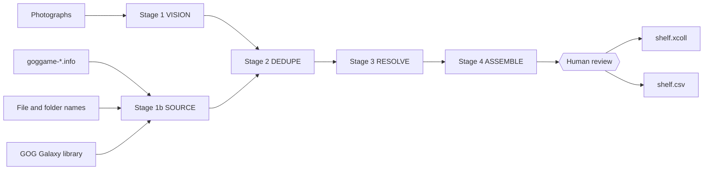
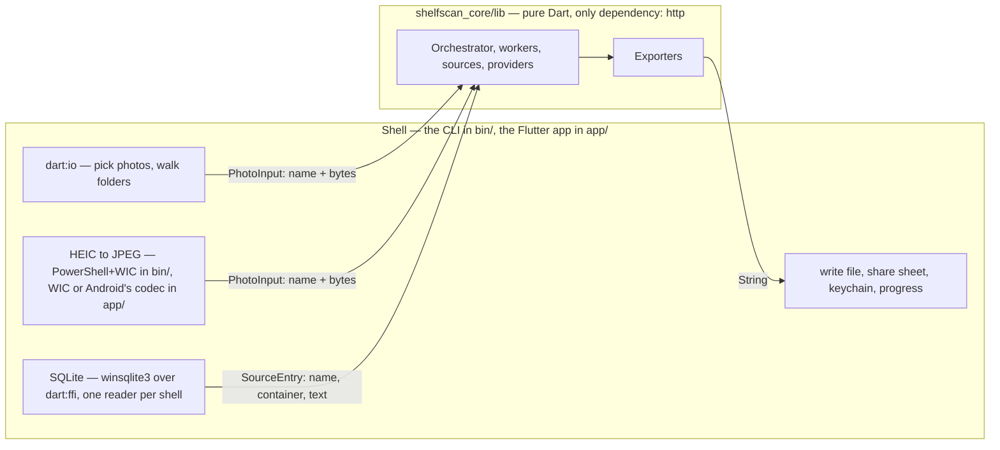
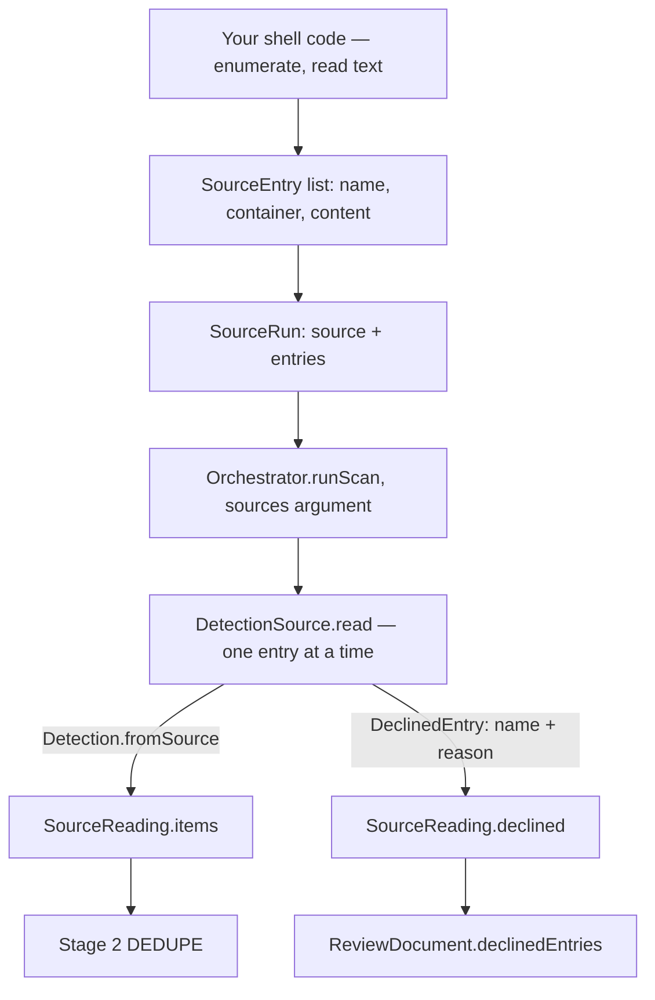

# Architecture

## Overview

shelfscan is a pipeline utility, not an application. It turns photos of a
physical shelf — and, since T-0155 and T-0179, what is already on the machine
— into an importable collection file for existing collection managers. The
shelf was games alone until T-0162; a disk source now answers films and
animation series too, and decision 0015 makes the kind a property of the row
rather than of the run.
It deliberately owns **no catalog UI and no database** — those belong to the
target apps (Tonkatsu Box, CLZ, ...).



**What the picture adds to the prose below: photographs are one source among
four, not the pipeline.** Every box on the left is a real reader —
`VisionProvider`, `GogMetadataSource`, `FilenameSource`, `GogLibrarySource` —
and a run may hold any combination of them, including none of the photographs.
They meet at one dedupe, which is what makes a run reconcilable: a game owned
on a disc and installed on disk is one row, not two documents.

The intermediate `*.review.json` file is the core contract of the whole
tool: everything before it is recognition, everything after it is
formatting. The human review step sits exactly on that boundary — as a
hand-editable file in the CLI, as the review screen in the app.

## Orchestrator / worker model

The `scan`, `scan-installs` and `scan-library` commands all run the same staged
pipeline coordinated by the `Orchestrator`. The orchestrator owns stage
ordering, fan-out, and error aggregation; workers own single tasks and their
own retry policy.

```
Orchestrator
 ├─ Stage 1:  VISION   VisionWorker × N   (parallel, one task per photo)
 │                     └─ VisionProvider (Ollama local / Anthropic /
 │                        any OpenAI-compatible endpoint)
 ├─ Stage 1b: SOURCE   DetectionSource.read (no pool, no retry: it makes
 │                     no request — one SourceRun after another, in order)
 ├─ Stage 2:  DEDUPE   (single-threaded merge across photos and sources)
 ├─ Stage 3:  RESOLVE  ResolverWorker × M (parallel, one task per detection)
 │                     └─ IgdbClient (shared, one token across lanes)
 └─ Stage 4:  ASSEMBLE build ReviewDocument (the shell writes the file)
```

Either half of stage 1 may be empty: photographs alone, sources alone (on an
`Orchestrator.resolveOnly`, which has no vision provider to call), or both in
one run. Stage 3 is keyed on catalogues, not on one credential: both shells
pick `SkipResolver` only when no catalogue is configured at all, and it
returns every detection unmatched — the same shape a failed resolution
degrades to, so review and both exporters handle it unchanged. Configure some
but not all, and they pick a `CatalogueRouter` with `SkipResolver` behind it:
a run holding a TMDB token and no IGDB pair looks its film and anime rows up
and leaves its game rows unmatched (T-0387).

Design rules:

- **Workers hold no per-task state.** The shared state that exists — the
  Twitch token and the IGDB rate window — lives in `IgdbClient`, not in a
  worker: concurrent lanes share one in-flight refresh future rather than
  stampeding Twitch, and the first token failure is remembered so later rows
  degrade with the same sentence instead of asking again (T-0144).
- **Workers never talk to each other.** Data flows only through the
  orchestrator between stages.
- **A failed task never kills the run.** A bad photo is skipped with a
  log entry; a failed resolution degrades to an unresolved entry that
  the human handles during review.
- **Retries live in the worker base class** (`RetryableException` +
  exponential backoff), so rate limits from either API are handled
  uniformly — each provider still classifies its own statuses. One
  deliberate exception: the Twitch token's 429 and 5xx are retried inside
  `IgdbClient._refreshToken`, not through `Worker.run`, because T-0144
  caches the first token failure — a retry outside would be answered from
  that cache, sleeping once per row with no request leaving the machine.
  Retrying where the request is made prices it once per run instead of
  once per detection (T-0143).

## Module map

Two-package layout: the pipeline is a pure Dart package with no Flutter
dependencies; the Flutter app and the CLI are both thin shells over it.

```
packages/shelfscan_core/
├── bin/shelfscan.dart         # CLI: scan / scan-installs / scan-library / resolve / export
├── bin/galaxy_db.dart         # shell: GOG Galaxy library db over dart:ffi (Windows)
└── lib/src/
    ├── models.dart            # canonical models + review JSON (de)serialization
    ├── orchestrator.dart      # pipeline stages, fan-out, ScanProgress callbacks
    ├── workers/
    │   ├── base.dart          # Worker base, retry/backoff, runPool
    │   ├── vision.dart        # photo -> [Detection]
    │   └── resolver.dart      # Detection -> ResolvedGame (fuzzy match + aliases)
    ├── providers/
    │   ├── vision.dart        # VisionProvider + Anthropic implementation
    │   ├── ollama_vision.dart # local VisionProvider (Ollama, Windows default)
    │   ├── openai_compatible_vision.dart # any /chat/completions endpoint
    │   ├── igdb.dart          # IGDB search via Twitch OAuth
    │   └── tmdb.dart          # TMDB search: films, and series by endpoint
    ├── sources/               # DetectionSource impls: text in, Detection out
    │   ├── filename_source.dart # file/folder name -> Detection (or a decline)
    │   ├── gog_library.dart   # GOG Galaxy library row (owned, not installed)
    │   └── gog_metadata.dart  # goggame-*.info (GoG install) -> Detection
    ├── exporters/
    │   └── exporters.dart     # Exporter base + tonkatsu (.xcoll) + csv
    ├── photo_format.dart      # what bytes ARE; naming them is not decoding them
    ├── title_key.dart         # the normalization dedupe and the resolver share
    ├── http_timeout.dart      # every outbound call is bounded, in one place
    └── unreachable.dart       # "that endpoint answered nothing", one vocabulary

app/                           # Flutter shell: Windows + Android
├── assets/
│   ├── data/title_aliases.json  # regional title -> IGDB canon; both shells
│   └── tmdb/blue_long_1.svg     # TMDB's mark, as published
└── lib/
    ├── main.dart
    ├── provider_config.dart  # provider policy per platform — lives here and nowhere else
    ├── settings_store.dart   # secrets -> OS keychain, the rest -> preferences
    ├── title_aliases.dart    # loads the alias table (bundled asset)
    ├── export_saver.dart     # save dialog (desktop) / share sheet (Android)
    ├── photo_files.dart      # which picked files are photos, by signature
    ├── input_picker.dart     # the pick dialogs, behind an interface we own
    ├── heic_decoder.dart     # what a HEIC decoder is, and how it fails
    ├── heic_wic.dart         # HEIC -> JPEG over dart:ffi, and the host gate
    ├── heic_android.dart     # the same, through Android's own codec
    ├── media_folders.dart    # walks a media folder into SourceEntry list
    ├── galaxy_db.dart        # the CLI reader's twin; dart:ffi cannot live in core
    └── screens/
        ├── scan_screen.dart   # pick photos, run pipeline, progress
        ├── settings_screen.dart # backend choice + the user's own API keys
        └── review_screen.dart # approve/reject/edit, export
```



**What the picture adds: every arrow into core carries a pure value, and that
is why one file exists twice.** `galaxy_db.dart` is in `bin/` and in `app/lib/`
as a deliberate copy — a `dart:ffi` SQLite reader cannot live in core, and the
shell that needs it cannot import the other shell's. HEIC decoding is the same
shape three times over: the CLI may spawn `powershell` and an app may not, so
the app decodes through WIC over `dart:ffi` on Windows and through the
platform's own codec on Android — one `HeicDecoder` signature in
`heic_decoder.dart`, and a host gate in `heic_wic.dart` that picks between
them.

Platform boundary rules:

- `shelfscan_core` imports no Flutter, no `dart:io` and no `dart:ffi`, and
  declares `http` and nothing else. The last three are each pinned by a test
  (`filename_source_test.dart`, `gog_library_test.dart`), because a source and
  a database reader are exactly what would be tempted to break them. Photos
  arrive as bytes (`PhotoInput`), source entries as text (`SourceEntry`),
  exporters return strings. This is what makes the same pipeline run in the CLI
  and on Android (where stable file paths are not guaranteed).
- The app owns everything platform-specific: pickers, secure key storage,
  save/share dialogs, progress rendering via `ScanProgress` callbacks.
- Naming bytes is not decoding them: `photo_format.dart` is core because what
  a file *is* is a property of its bytes, and both cloud providers have to
  label the upload with it (T-0036).
- The CLI in `bin/` is the validation harness: the go/no-go vision
  quality check runs there before any UI work.

## Key decisions

1. **Canonical intermediate format over direct export.** Exporters are
   thin adapters over `ResolvedGame`; adding a new target app never
   touches recognition code.
2. **Review is one contract, two frontends.** The CLI treats
   `review.json` as human-editable; the app renders the same document as
   an approve/reject screen. Both feed the same exporters.
3. **Resolution is the moat.** Spine OCR is noisy and regional titles
   (Biohazard/Resident Evil) diverge from IGDB canon. The resolver
   isolates this complexity: normalization + alias table + fuzzy scoring
   + platform-constrained search, with a confidence threshold that
   decides "auto-match" vs "ask the human".
4. **External formats are pinned contracts.** The Tonkatsu `.xcoll`
   writer pins `version: 2`; upstream format changes get a new writer,
   not a mutation.

## Extension points

- New vision backend: implement `VisionProvider`, wire it in the CLI/app.
- New export target: implement `Exporter`, register it in `exporters`.
- New detection source — anything that names a work without being
  photographed:
  implement `DetectionSource` and add a `SourceRun` to the list
  `Orchestrator.runScan` takes beside the photos, any of which may be empty
  (T-0155, T-0179). The shell does the reading — walking a directory, querying
  a local database — and the source turns a `SourceEntry`'s name, container and
  text into rows through `Detection.fromSource`, declining what it cannot use.
  The platform boundary above is what forces that split, exactly as it does for
  HEIC conversion. **The list is what makes a run reconcilable:** a shelf, a
  games folder and a GOG library go through one dedupe, so a game that is two
  of those is one row, and which source owns an entry is stated by the shell
  rather than guessed from the entry. The seam is drawn below.
- ~~Shelf pre-segmentation (split wide photos into strips)~~ — built,
  measured and rejected (T-0003); see doc/measurements.md for the numbers.
  It slots into `VisionWorker.process` cleanly enough, but on the real photos
  it found no additional item and invented titles the whole-photo read got
  right. T-0024 has since made a truncated read mergeable, but only when the
  cut lands mid-word and leaves a complete 5+ character word — strips
  produce sub-floor fragments like `COM` and `CHRO`, which it deliberately
  refuses to merge. So that is not the missing piece either.
- Camera capture on Android (image_picker) plugs into the scan screen
  and produces the same `PhotoInput`.
- ~~Alias table can graduate from a dict to a data file + IGDB
  `alternative_names` lookups inside the resolver only.~~ — done (T-0004).
  New regional titles go in `app/assets/data/title_aliases.json`, no Dart
  edit. The resolver takes the parsed map as a constructor argument because it
  may not read files itself (platform boundary above): the CLI reads the file,
  the app loads the same file as a bundled asset. It lives under `app/`
  because that is the only place a Flutter asset can live — a key declared by
  a `../` path is written outside the bundle and reaches no built app
  (T-0386).

### Where a new source plugs in



**What the picture adds: the seam has two outputs, and the second one is not an
error path.** An entry a source declined was read and held no game, which is an
answer — so it is named to the user rather than dropped, and a run whose every
entry declines still returns a document. `read` is synchronous, because an
implementation parses text the shell has already read: it opens nothing and
waits for nothing, which is why the stage needs no pool, no retry and no stop
check. A source that throws anyway has that entry declined for it, so one bad
entry cannot end a run.

Four implementations sit on this seam today: `GogMetadataSource`
(`goggame-*.info`), `FilenameSource` (file and folder names),
`GogLibrarySource` (GOG Galaxy rows), and `InstalledGameSource` — not a reader
at all but a router, handing each entry to the first two by name. Its rows are
not all games: `FilenameSource` has answered `WorkKind.movie` since T-0162, so
a film sitting in that folder leaves the seam as a film. Being shell code, that
last one exists once in `bin/` and once in `app/lib/`.
